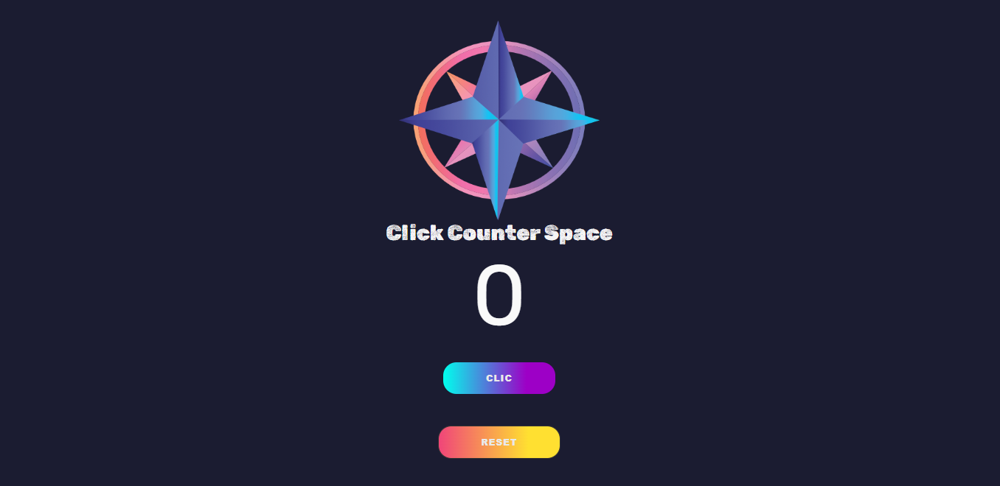
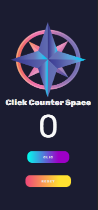

# React Project Counter
-
This is a small click counter project made in **React**, made for the mere purpose of introducing me to **hooks and interactivity**, I also decided to put some care in **CSS** so it is also **responsive**, although the amount of elements is very simple, **it is not very complex**.
-
## Preview
\begin{center}

\end{center}
## acknowledgments
I have to thank [@freeCodeCamp](https://twitter.com/freecodecampES). for their courses and explanatory videos.
 <https://www.youtube.com/watch?v=6Jfk8ic3KVk>

enjoy
